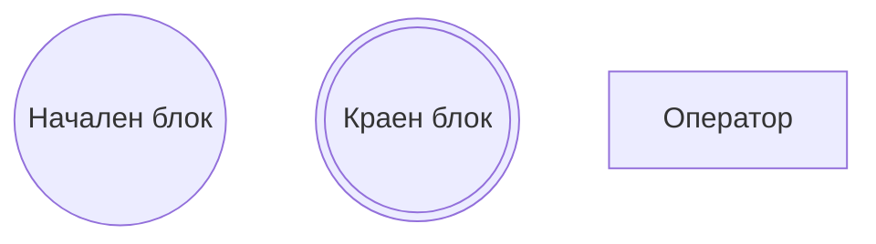
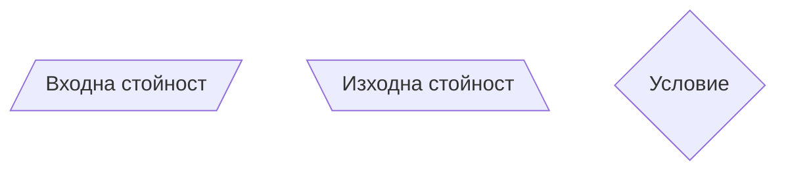
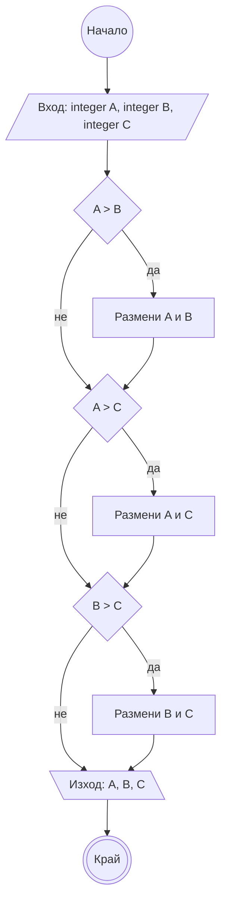

## Дефиниция на променливи и константи. Типове. Аритметични и логически оператори. Оператори за сравнение. 

### Дефиниция на променливи и константи 

#### Променливи
**Дефиниция:**
<тип> <име> = <стойност>;

*Примери:* 
```c++
int number = 5;
char symbol;
```

**Свойства:**
- името започва с латинска буква и може да съдържа цифри и долна черта; не може да съдържа интервали и препинателни знаци
- стойността им може да се променя в хода на програмата
- възможно е да се дефинират без първоначална стойност

#### Константи
**Дефиниция:**
**const** <тип> <име> = <стойност>;

*Пример:* 
```c++
const int number = 5;
```

**Свойства:**
- името започва с латинска буква и може да съдържа цифри и долна черта; не може да съдържа интервали и препинателни знаци
- стойността им *задължително* се задава при дефиниране 
- стойността им *не може* да се променя в хода на програмата

> **Tip:**
> 
> По конвенция, променливите се именуват с малки букви в стандарт camelCase (т.е. всяка нова дума започна с главна буква, без разстояние между думите).
> По конвенция, константите се именуват с главни букви и долна черта между думите, т.е. стандарт UPPER_SNAKE_CASE.
> Променлива или константа съществува само в блока код, в който е дефинирана.


#### Преобразуване на типове
**Експлицитно:** Когато преобразуването е изрично указано в програмата. </br>
<тип 1> <променлива 1> = <стойност>; </br>
<тип 2> <променлива 2> = (<тип 2>) <променлива 1>;


*Пример:*
```c++
const double number = 5.78;
int integer = (int) number;
```

**Имплицинто:** Когато преобразуването се случва без това да е видимо при четене на програмата. Това не винаги е възможно.


*Пример:*
```c++
const int number = 5.78;
```


### Основни типове данни
**Внимание:** Размерът и приеманите стойности са зависими от архитектурата на процесора. Представените стойности се приемат за стандартни в рамките на курса.

| тип          | размер  | описание                           | приемани стойности                             |
|--------------|---------|------------------------------------|------------------------------------------------|
| bool         | 1 byte  | Двоично число                      | true/false                                     |
| char         | 1 byte  | Единичен символ от [ASCII таблицата](https://www.alpharithms.com/s3/assets/img/ascii-chart/ascii-table-alpharithms-scaled.jpg) | [0; 255]                                       |
| short        | 2 bytes |  Цяло число                        | [-32768, 32767] == [2^16, 2^16-1] |
| int          | 4 bytes |  Цяло число                        | [−2147483648,  2147483647] == [2^32, 2^32-1] |
| unsigned int | 4 bytes | Неотрицателно цяло число           | [0, 4294967295] == [0, 2^33-1]                |
| float        | 4 bytes | Дробно число                       | 7 цифри прецизност                             | 
| long         | 8 bytes | Цяло число                         | [-9223372036854775808, 9223372036854775807] == [2^64, 2^64-1]  |
| double       | 8 bytes | Дробно число                       | 15 цифри прецизност                            |

### Основни оператори
| Оператор | Описание | <div style="width:100px" /> Пример| Резултат от примера                    | Оператор | Описание | Пример | Резултат от примера |
|----------|----------|-------------|-------------------------------|-----------|----------|--------|-------------------------------|
| =        | Оператор за присвояване | int a = 5 | Присвоява на променливата a стойност 5 | | | 
| ==       | Оператор за сравнение "равно" | a == b | връща true при равни стойности, false в противен случай                    | !=       | Оператор за сравнение "различно" | a != b  | връща true при различни стойности, false в противен случай
| >       | Оператор за сравнение "по-голямо" | a > b | връща true, ако a е с по-голяма стойност от b, false в противен случай                  | >=       | Оператор за сравнение "по-голямо или равно" | a >= b | връща true, ако a е с по-голяма или равна стойност от b, false в противен случай 
| <       | Оператор за сравнение "по-малко" | a < b | връща true, ако a е с по-малка стойност от b, false в противен случай                  | <=       | Оператор за сравнение "по-малко или равно" | a <= b | връща true, ако a е с по-малка или равна стойност от b, false в противен случай 
| +        | Оператор за събиране | c = a + b | Връща се нова стойност, която се присвоява на c | +=       | Оператор за събиране и присвояване | a += b | Резултатът a + b се присвоява на a
| -        | Оператор за изваждане | c = a - b | Връща се нова стойност, която се присвоява на c | -=       | Оператор за изваждане и присвояване | a -= b | Стойността a - b се присвоява на a
| *        | Оператор за умножение | c = a * b | Връща се нова стойност, която се присвоява на c | *=       | Оператор за умножение и присвояване | Стойността a * b се присвоява на a
| /        | Оператор за деление | c = a / b; </br> 5 / 2 == 2; </br> 5.0 / 2 == 2.5 | Връща се нова стойност, която се присвоява на c. При цели числа, това е целочислената стойност на делението, като остатъкът се игнорира. При деление на 0, поведението е недефинирано | /=       | Оператор за деление с присвояване | a /= b | Стойността a / b се присвоява на a
| %        | Оператор за остатък при деление (деление по модул) | c = a % b; </br> 5 % 2 = 1 | Връща се нова стойност - остатъка от целочисленото деление на a и b, която се присвоява на c. Работи с цели положителни числа. При дробни или неположителни числа, поведението не е дефинирано. | %=       | Оператор за деление по модул с присвояване | a %= b | Стойността a % b се присвоява на a
| ++        | Съкратен запис на += 1 | a++; ++a; b = ++a; | Стойността на a се увеличава с единица. Префиксно - стойността първо се увеличава с 1, после се връща като резултат от оператора; Постфиксно - старата стойност се връща като резултат от изпълнението | --        | Съкратен запис на -= 1 | a--; --a; b = --a; | Стойността на a се намалява с единица. Префиксно - стойността първо се намалява с 1, после се връща като резултат от оператора; Постфиксно - старата стойност се връща като резултат и след това се намалява с 1 


#### Tips & Tricks:
| <div style="width:100px" />           |  <div style="width:175px" /> Грешно     |  <div style="width:250px" />  Правилно | Защо?       |
| --------- | ----------- | --------- | ----------- |
| Делене на цели числа с цел получаване на дробно число       | int a = <стойност 1>; </br> int b = <стойност 2>; </br> double result = a / b; | int a = <стойност 1>; </br> int b = <стойност 2>; </br> double result = (double) a / (double) b; | При делене на цели числа, полученият резултат също е цяло число. Ако желаният резултат е десетична дроб, то първо е необходимо преобразуване на делителите до дробни числа. 
Префиксни и постфикси оператори |  | int a = 5; </br> int b = 5; </br> int a1 = a++; // a1 == 5, a == 6 </br> int b1 = ++b; // b1 == 6, b == 6 | При постфиксния оператор a++, увеличаването на стойността се извършва след присвояване на старата стойност. При префиксния оператор ++b, първо се увеличава стойността, а след това се извършва присвояването с новата стойност. 


-------------------

### Входни и изходни данни и оператори
 
 **STD** - STanDard library in C++

#### Стандартен вход
- **std::cin**
   - std -> standart library
   - c ->  C/C++
   - in -> input
- оператор **>>** - входен поток
- въвеждане на повече от една променлива:  `std::cin >> a >> b;`

#### Стандартен изход
- **std::cout**
   - std -> standart library
   - c ->  C/C++
   - out -> output
- оператор **<<** - изходен поток
- **std::endl**
	- еnd of line
- идвеждане на повече от една стойност:  `std::cout << a << b << std::endl;`

> **Tip:**
>
> вход **>>** програма **<<** изход

-------------------
## Структура на C++ програма

- **iostream** - входно/изходна библиотека
	- необходима за работа със стандартните вход и изход
	- *#include* - директива за включване на библиотеки; винаги на първо място в кода на програмата
		- *#include <**iostream**>*
- **main** - главна функция, която се изпълнява при стартиране на програмата
- **{}** - блок от команди; "тяло" на функция или операция
- **;** - край на операция
- **'a'** - единичен символ
- **"hello world!"** - текст
- **return** - връщане на резултат; по стандарт връщаният резултат от главната функция е 0 и символизира успешно завършване на изпълнението на програмата


**Пример:**
 ```c++
 #include <iostream>

 int main() {
	std::cout << "Hello world!" << std::endl;

	int number1, number2;
	double dnumber1;
	const int const1 = 3;
	
	std::cin >> number1 >> number2 >> dnumber;
	
	std::cout << number1 / const1 << " " << number2 % const1 << std::endl;
	std::cout << dnumber / const1 << std::endl;

	return 0;
} 
 ```
Какво ще изведе програмата?

-------------------

> **Съвети за качествен код:**
> - избягване на еднобуквени променливи в полза на значими имена
> - разделяне на логическите части на програмата с по един празен ред
> - ограждане на операторите с интервал от двете страни
> - идентация от 4 интервала (или 1 табулация) надясно за всеки вложен блок от код
> - консистентност при поставянето на отварящи скоби - на същия ред като оператора или на следващия
> - всяко извеждане завършва с нов ред; елементите, които се извеждат на един ред, са разделени от интервал


-------------------
## Блок схема
Блок схемите са лесен начин да се представи визуално даден алгоритъм. Те са универсални и независими от програмния език, на който се реализира алгоритъма. 

**Основни блокове:**



**Пример:**

*Задача:* Да се въведат три числа. Да се подредят в нарастващ ред.


