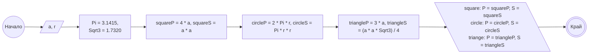

### Задача 1
- Да се дефинира променлива boolFlag, която може да приема стойности “истина” или “лъжа” и да се инициализира със стойност “истина”.
- Да се дефинира булева променлива boolFlagNumb и да се инициализира със стойност 5.
- Да се дефинира булева променлива boolFlag0Numb и да се инициализира със стойност 0.
- Да се обясни какви са стойностите на boolFlagNumb и boolFlag0Numb - “истина” или “лъжа”.

---

### Задача 2
- Да се дефинира символна променлива charA със стойност 'a'. 
- Да се дефинира символна променлива charOneCh със стойност '1’.
- Да се дефинира символна променлива charOneNumb със стойност 1.
- Да се дефинира символна променлива char65 със стойност 65.
- Да се обясни разликата между charOneCh и charOneNumb? 
- Какво ще се изведе на екрана, ако се отпечата char65  с оператора std::cout?

---

### Задача 3
Да се въведат две положителни числа **а** и **r**. Да се изведе лицето и обиколката на:

- квадрат със страна **а**;
- кръг с радиус **r;**
- равностранен триъгълник със страна **а**.

Нека за целите на задачата константите се закръглят до *4 знака* след десетичната запетайка, съответно:

$\pi = 3.1415$

$\sqrt{3} = 1.7320$

#### Пример:

*Вход:* 4 4

*Изход:*

square: P = 16, S = 16

circle: P = 25.132, S = 50.264

triangle: P = 12, S = 6.928

---

### Задача 4

Огледално на дадено цяло число number се нарича такова число, съставено от цифрите на number, но подредени в обратен ред. Да се напише програмен фрагмент, който въвежда цяло четирицифрено число и намира и извежда огледалното му число.

#### Пример 1:

**Вход:** 7121

**Изход:** 1217

#### Пример 2:

**Вход:** -3567

**Изход:** -7653

---

### Задача 5:

Да се изведе сумата на всички числа от затворения интервал [A, B]. 
Гарантирано е, че B >= A.

#### Пример 1:

**Вход:** 1 10

**Изход:** 55

#### Пример 2: 

**Вход:** 7 15

**Изход:** 99

---

###  Задача 6:

Да се напише потребителски интерфейс, който изисква от потребителя да въведе количество и цена за ябълки, портокали и банани. Накрая да се изведе сметката на потребителя: какъв брой от какво си е поръчал и колко ще му струва.

#### Пример:

**Вход:**

Apples: 2 0.6

Oranges: 1 1.5

Bananas: 3 0.78

**Изход:** Your order is: apples for 1.2, oranges for 1.5 and bananas for 2.34. Total: 5.04.

