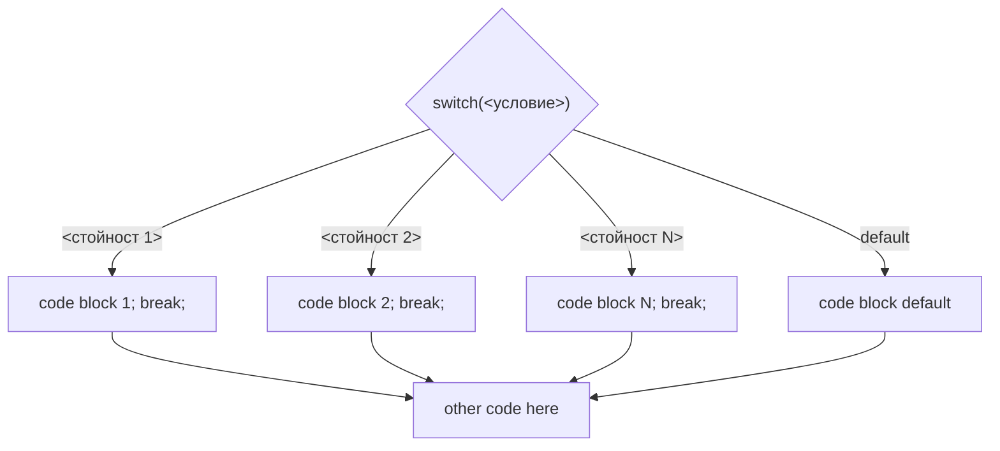

## Побитови операции. Логически операции. Условни оператори.

### Побитови операции 
#####  Свойства:
- Процесорни инструкции
  - Най-бързите възможни операции
- Изпълняват се върху цели числа 
- Изпълняват се върху signed по подразбиране 
  - Необходимо е да се внимава с отрицанията
- Константите се приемат за тип int по подразбиране 
  - За други типове е необходиво конвертиране
     - 5 -> int
     - 5L -> long
     - 5LL -> long long
 - Изпълняват се побитово върху двоичния запис на числото

#####  Операции:
| A | B | ~A |  A & B | A \| B | A ^ B |
|---|---|----|--------|--------|-------|
| 1 | 1 | 0  | 1      | 1      | 0     |  
| 1 | 0 |    | 0      | 1      | 1     |  
| 0 | 1 | 1  | 0      | 1      | 1     |  
| 0 | 0 |    | 0      | 0      | 0     | 

Да се обърне внимание, че примерите са дадени с пълни 16-битови записи на числата без знак (unsigned). Ако числата са знакови (signed), ще се спазва правилото за двойното допълнение (two's complement) за репрезентиране на отрицателни числа.

- NOT ( ~ )
 ```
~ 0000010100111001(2) =>  1337(10) 
= 1111101011000110(2) => 64198(10)
```
- AND ( & )
```
  0000010100111001(2) => 1337(10) 
& 0001000001110101(2) => 4213(10) 
= 0000000000110001(2) =>   49(10)
```
- OR ( | )
```
  0000010100111001(2) => 1337(10) 
| 0001000001110101(2) => 4213(10) 
= 0001010101111101(2) => 5501(10)
```
- XOR ( ^ )
 ```
   0000010100111001(2) => 1337(10) 
 ^ 0001000001110101(2) => 4213(10) 
 = 0001010101001100(2) => 5452(10)
```
- Shift Left ( << )
```
   0000010100111001(2) =>  1337(10)
<< 0000000000000011(2) =>     3(10)
 = 0010100111001000(2) => 10696(10)
```
- Shift Right ( >> )
```
   0000010100111001(2) => 1337(10) 
>> 0000000000000011(2) =>    3(10) 
 = 0000000010100111(2) =>  167(10)
```

### Логически операции 
#####  Свойства:
- Стандартни оператори
- Първо превръщат аргументите си в `true/false` стойности и се изпълняват върху тях
- Изпълняват се отляво на дясно до достигане на еднозначен резултат. След достигане на такъв, останалите операции се игнорират (short-circuit)
  - Пример: `true || (false && true) || !(!false && true)`
      - `true || <каквото и да е> == true` => целият израз е с резултат `true`, изразите не се пресмятат никога 
      - Пример: `(false && true) && !(!false || true)`
      - пресмята се `(false && true)` => `false && !(!false || true)`
      - `false && <каквото и да е> == false` => целият израз е с резултат `false`, вторият израз не се пресмята никога
 - Приоритетът на операциите е  `!`, `&&`, `||`
     - Изразът `true || false && true || !false && true` ще се сведе до `true || (false && true) || ((!false) && true)` 
     - Оттук нататък важи правилото за пресмятане отляво надясно


#####  Операции:

- NOT ( ! )
- AND ( && )
- OR ( || )

| A     | B     | !A     | A && B | A \|\| B |
|-------|-------|--------|--------|---------|
| true  | true  | false  | true   | true    | 
| true  | false |        | false  | true    |
| false | true  | true   | false  | true    | 
| false | false |        | false  | false   |

> **Tip:**
>  Побитовите и логическите операции, макар и със съвпадащи имена, дават различна стойност при изчисление. Затова е необходимо да се внимава за желания резултат.
> Пример:
> ~3 => -4 
> !3 => false  => 0
> 

### Условни оператори

#### If - else
- Проверява се истинноста на логически израз (условие)
- Ако условието е истина, се изпълнява определен блок код
	- Ако условието е лъжа и присъства оператор `else`, се изпълнява друг блок код
- След изпълнение на условния оператор, действието на програмата продължава 

```c++
	if (<условие>) {
		<code block true>
	}
```


```c++
	if (<условие>) {
		<code block true>
	}
	else {
		<code block false>
	}
```


#### Тернарен оператор
- Проверява се истинноста на логически израз (условие)
- Ако условието е истина, се връща определена стойност като резултат на изпълнение
- Ако условието е лъжа, то се връща друга стойност като резултат на изпълнение

```c++
	<type> a = <условие> ? <стойност 1> : <стойност 2>;
```


#### Switch
- Проверява се стойността на израз 
- Определя се поведението в различни случаи спрямо тази стойност
	- Изпълнението на програмата продължава до срещане на запазена дума `break`
	- Ако стойността не попада в нито един от посочените случаи, се изпълнява `default` клауза (ако такава е дефинирана)


```c++
	switch(<израз>) {
		case <стойност 1>: <code block 1>; break;
		case <стойност 2>: <code block 2>; break;
		....
		case <стойност N>: <code block N>; break;
		default: <code block default>;
	}
```



- При липса на оператор `break`, изпълнението не приключва, а се продължава с кода, свързан със следващите случаи

```c++
	switch(<израз>) {
		case <стойност 1>: <code block 1>;
		case <стойност 2>: <code block 2>;
		....
		case <стойност N>: <code block N>;
		default: <code block default>;
	}
```


### Влагане на условни оператори

```c++
	if (<условие 1>) {
		<code block 1>
	}
	else if (<условие 2>) {
		<code block 2>
	}
    else {
        <code block 3>
    }
```


```c++
	if (<условие 1>) {
		if (<условие 2>) {
            <code block 1>
        }
        <code block 2>
	}
    else {
        <code block 3>
    }
```


>  **Съвети за качествен код:**
>  - идентиране на кода в тялото на оператора с 4 интервала или 1 табулация навътре от родителското тяло
>  - влагането на тернални оператори е възможно, но силно непрепоръчително
>  - при оператор switch случаите се подреждат възходящо


#### Tips & Tricks:
| <div style="width:100px" />           |  <div style="width:175px" /> Грешно     |  <div style="width:250px" />  Правилно | Защо?       |
| --------- | ----------- | --------- | ----------- |
| Тернарен оператор                     | if (<условие>) { </br> result = <стойност 1>; </br> } else { </br> result = <стойност 2>; </br>} | result = <условие> ? <стойност 1> : <стойност 2>; | Тернарният оператор може да се използва когато се очаква различен (еднакъв по тип) резултат в зависимост от това дали дадено условие е изпълнено
switch | if(<променлива> == <стойност 1>) { </br> <действие 1>; </br>} else if(<променлива> == <стойност 2>) { </br> <действие 2>; </br>} else if(<променлива> == <стойност 3>) { </br> <действие 3>; </br>} else { </br> <действие 4>; </br>}; | switch (<променлива>) { </br> case <стойност 1>: <действие 1>; break; </br> case <стойност 2>: <действие 2>; break; </br> case <стойност 3>: <действие 3>; break; </br> default: <действие 4>; </br>}; | 
Сравнение на дробни числа | double a = <стойност 1>; </br> double b = <стойност 2>; </br> (a == b); | double a = <стойност 1>; </br> double b = <стойност 2>; </br> double epsilon = 0.0001; </br> (abs(a - b) < epsilon); | Сравнението на числа с плаваща запетая не работи като целочисленото сравнение. За да се сравнят две стойности с плаваща запетая, трябва да се вземе предвид точността на сравнение. За тази цел се използва псевдоприближение (+/- epsilon).