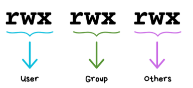

### Задача 1

Напишете програма, която приема 4 числа и проверява кое от последните 3 числа е най-близо до първото.

---

### Задача 2

Да се напише калкулатор, който първо приема символ $$op \in \{\text{'+'},\ \text{'-'},\ \text{'*'},\ \text{'/'},\ \text{'\%'}\}$$ и после приема 2 реални числа `a` и `b`, като принтира резултата от `a` `op` `b`. Операциите са съответни на тези в С++.

---

### Задача 3

Дадена е редица от 5 числа. Да се изведе "yes", ако всяко число в нея е едновременно по-голямо или равно от съседите си или пък едновременно по-малко или равно от тях. В противен случай, "no".

Вход: -12 20 -3 12 -36 
<br />
Изход: yes

Вход: 3 5 2 0 39
<br />
Изход: no

---

### Задача 4

Да се напише програма, която при подадени радиус r и двумерна точка (х, у) проверява дали точката се намира вътре, отвън или по контура на окръжност с център в (0,0).

---

### Задача 5

По подадена година `year` да се върне `leap`, ако е високосна. Иначе `ordinary`. 
```
If a year is divisible by 4: It is a leap year.
If a year is divisible by 100: It is not a leap year.
If a year is divisible by 400: It is a leap year, overriding the rule for 100. 
```

---

### Задача 6

Да се напише програма, която работи с 4 геометрична фигури:  квадрат (s), правоъгълник (r), кръг (c) и триъгълник (t), и пресмята лицето им. На първия ред на входа се чете вида на фигурата (s, r, c или t). Ако фигурата е квадрат, на следващия ред се чете едно число – дължина на страната му. Ако фигурата е правоъгълник, на следващите два реда четат две числа – дължините на страните му. Ако фигурата е кръг, на следващия ред чете едно число – радиусът на кръга. Ако фигурата е триъгълник, на следващите два реда четат две числа – дължината на страната му и дължината на височината към нея. Резултатът да се закръгли до 2 цифри след десетичната запетая.
<br />

**Note**: За такъв тип задачи със случаи, определени от една величина/променлива, ползвайте switch. В случая тази величина е символът, който се подава първи.

Вход: s 5 , Изход: 25

Вход: r 7 2.5, Изход: 17.5

Вход: c 6, Изход: 113.097

---

### Задача 7

По подадени 3 точки `(x1, y1)`, `(x2, y2)` и `(x3, y3)` изпечатайте `аligned`, ако те се намират на една линия. Иначе, `wavy`.
<br />
**Hint:** Може да се реши под ва начина:
  1. с анализ - ъглов наклон
  2. с детерминанта(май още не сте учили по линейна за детерминанти, така че питайте, за да ви разкажа, ако ви интересува)

---

### Задача 8

В Unix-based ОС файловете имат различни права на достъп спрямо собственик на файла, група на файла(множество от потребители) и всички останали. Тези права могат да се задават с трицифрено число в осмична бройна система. Първата цифра от числото в осмична бр. система представя правата на собственика(user от снимката), втората - на групата, а третата - на други потребители. Всяка цифра се превръща в число в двоична бройна система и спрямо това кой бит е 1-ца, се показва `r`/`w`/`x` (read/write/execute access). A ако битът е 0, се показва `-`.

Пример 1: Ако ни е подадено числото `616`, тогава имаме двоичното число `110 001 110` -> rw- --x rw-.

Пример 2: `452` -> `100 101 010` -> r-- r-x -w-


По подадено трицифрено число в осмична бройна система(тоест три цифри между 0 и 7), да се отпечатат правата на достъп за файл спрямо това число. Оставянето на места между отделните тройки символи е опционално.

