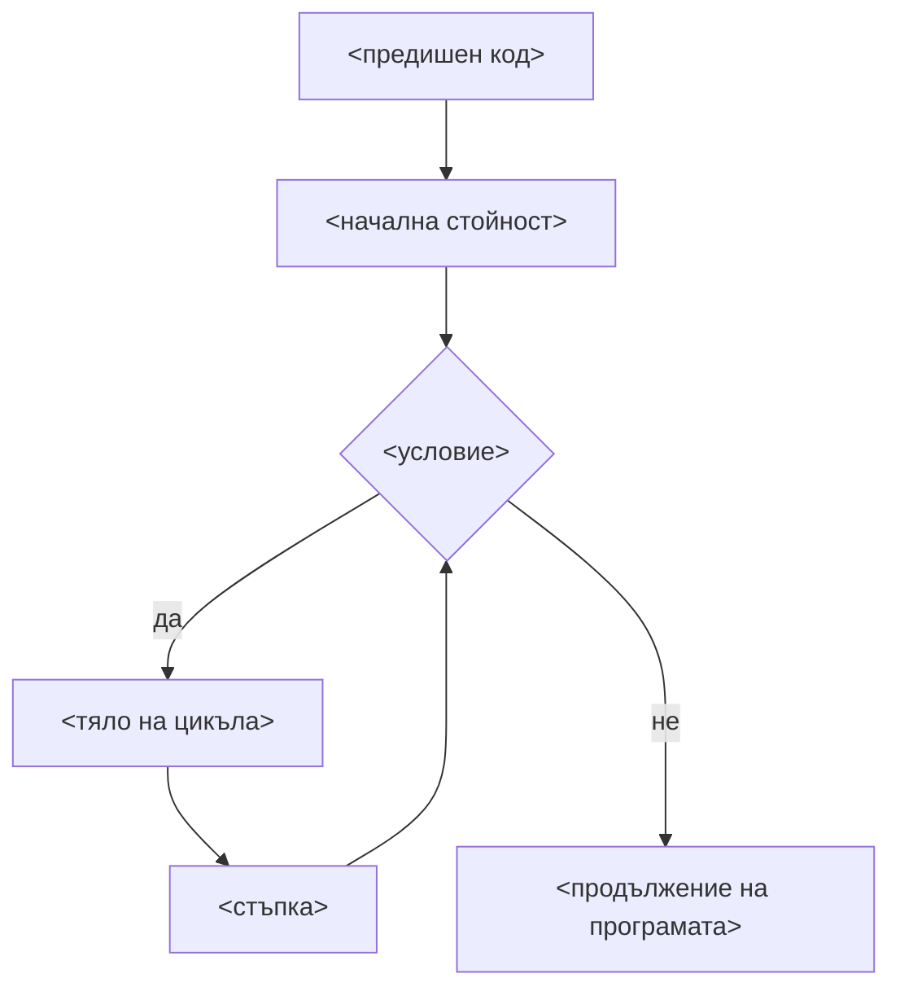
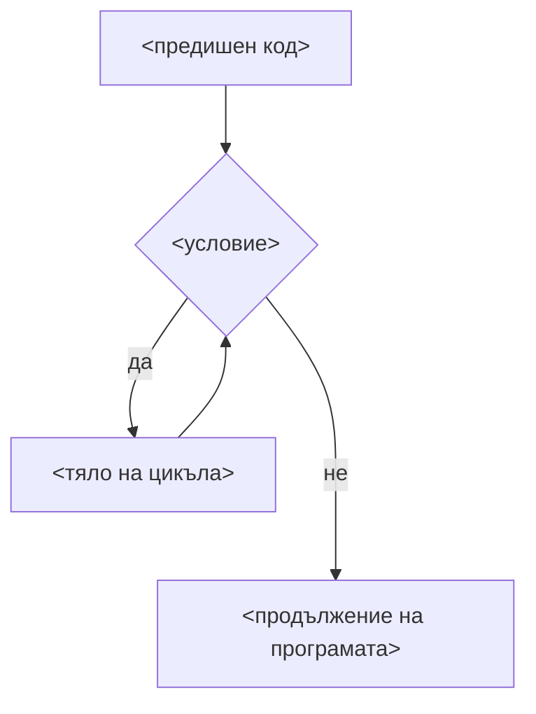
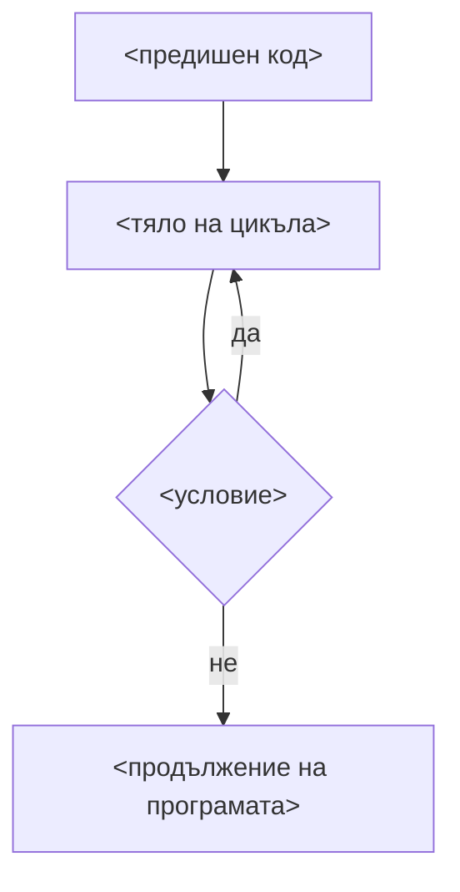

## Циклични оператори

### For
- Наличие на свързана променлива
	-  областта й на действие е тялото на цикъла
- Еднозначно дефинирана стъпка, повтаряща се в края на всяко изпълнение

```c++
	for (<начална стойност>; <условие>; <стъпка>) {
		...
	}
```



### While

```c++
	while (<условие>) {
		...
	}
```



### Do-while
- Тялото на цикъла винаги се изпълнява поне веднъж


```c++
	do {
		...
	} while (<условие>);
```




