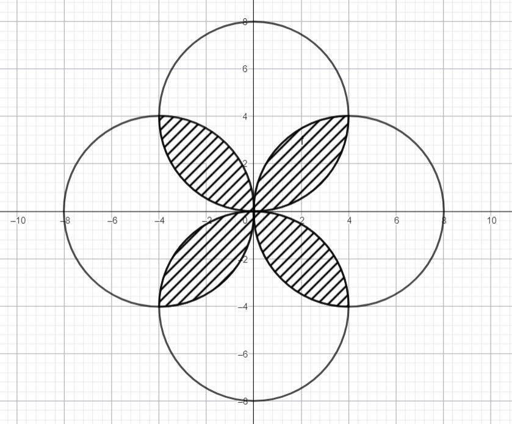

### Задача 1

Различно число е такова число, при което всеки две съседни цифри са с различна четност. Да се напише програма, която по подадени две цели числа a и b намира сумата на числата в интервала [a, b], които са различни числа.

#### Пример:
123 e различно число  
235 НЕ е различно число  
1237 НЕ е различно числo  

#### Пример:

**Вход:**   
3  
23  

**Изход:** 133

---

### Задача 2

Дадена е точка в равнината с координати (x, y). Илюстрираните окръжности са с диаметър 4 и областите включват контурите си.

Да се напише програмен фрагмент, който проверява дали точка принадлежи на защрихованата област.

#### Пример:

**Вход:**   
-3.25 2.83 

**Изход:** Yes

Да се напише програмен фрагмент, който по зададен радиус генерира аналогична фигура и проверява дали дадена тока принадлежи на съответната защрихована област.

#### Пример:

**Вход:**   
2.5  
-3.25 2.83 

**Изход:** No

---

### Задача 3

Да се напише програмен фрагмент, който въвежда цяло положително число number от клавиатурата. Кодът да връща най-голямото число, което може да се получи чрез замяна на (всички срещания) на някоя от цифрите на number с цифра, която не се среща в number. Ако не е възможно числото да стане по-голямо чрез замяна на цифри, да се върне същото число.

#### Пример 1:

**Вход:** 1182  
**Изход:** 9982

#### Пример 2:

**Вход:**  9871  
**Изход:** 9876

#### Пример 3:

**Вход:**  9  
**Изход:** 9

---

### Задача 4

Дадено е цяло число n и n положителни числа, които представляват височините (в метри) на съседни и плътни прегради, поставени по дължината на аквариум с ширина 1 метър. Всеки 2 съседни прегради са на разстояние 1 метър една от друга.

Да се намери най-голямото количество вода (в литри), което може да се побере между 2 прегради в аквариума, след като останалите се премахнат. Обемът на преградите може да се пренебрегне.

#### Пример:

**Вход:**  
6  
1 8 5 9 3 7

**Изход:** 28000

#### Ограничения: 
2 <= n <= 1024

#### Пояснение на примера:
Между втората и последната стена може да се налее вода до седмия метър. Ако се налее повече от това, височината на водата ще надмине височината на една от стените и ще започне да тече.

1 (широчината на аквариума) * 4 (разстоянието между двете избрани стени) * 7 максималната височина на водата = 28 кубични метра

|   | 0 |   | 1 |   | 2 |   | 3 |   | 4 |   | 5 |
|---|---|---|---|---|---|---|---|---|---|---|---|
| 9 |   |   |   |   |   |   | i |   |   |   |   |
| 8 |   |   | I |   |   |   | i |   |   |   |   |
| 7 |   |   | I | . | . | . | i | . | . | . | I |
| 5 |   |   | I | . | i | . | i | . | . | . | I |
| 4 |   |   | I | . | i | . | i | . | . | . | I |
| 3 |   |   | I | . | i | . | i | . | i | . | I |
| 2 |   |   | I | . | i | . | i | . | i | . | I |
| 1 | I |   | I | . | i | . | i | . | i | . | I |

**Легенда:**  
 I - съществуваща преграда  
 i - премахната преграда  
 . - вода

