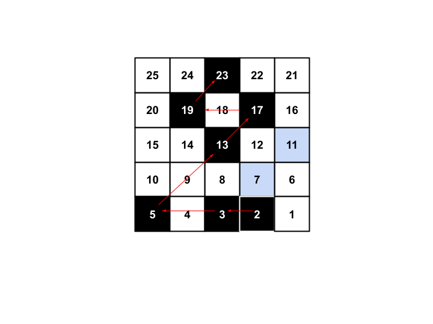

### Задача 1
Да се напише програма , която въвежда редица от произволни символи с размер sizeN и съставя хистограма на срещанията на всеки символ.

**Забележка:** Размерът на масивът не е предварително известен и следва да се заделя динамично. Хистограмата трябва да е точно толкова голяма, колкото различни символа има в редицата от символи

#### Пример:
**Вход:**  
55  
. . i l i k e t , ! g o 2 2 3 1 o U t w i t h F r i e 4 n 2 d s a n 2 d a t e K 4 3 2 F C p ! t o g e t h e r

**Изход:**  
.  3  
i  4  
l  1  
k  1  
e  5  
t  6  
,  1  
!  2  
g  2  
o  3  
2  5  
3  2  
1  1  
U  1  
w  1  
h  2  
F  2  
r  2  
4  2  
n  2  
d  2  
s  1  
a  2  
K  1  
C  1  
p  1

---

### Задача 2
Дядо Коледа е поставен пред дилема – трябва да реши на кого да занесе подаръци тази година. Джуджетата са му донесли списък с номера и списък с подаръци за момчета и момичета, а той знае следните неща:

- ако номерът съдържа в себе си **42**, то детето е много **добро** и задължително получава подарък.
- ако номерът съдържа в себе си **81**, то детето е много **лошо** и не получава подарък.
- ако номерът е **четен**, то детето е **момиче**.
- ако номерът е **нечетен** – **момче**.
- ако след раздаване на подаръците на много добрите деца са му останали още, то той ги раздава на тези, които са нито добри, нито лоши на **случаен принцип**.

След  като подреди списъка си с деца, то той се чуди колко подаръка за момче и колко за момиче ще раздаде тази година. Да се напише програма, която да му подскаже правилната бройка.

**Вход:** размер на списъка с номера – **N**, брой подаръци за момчета **B** и брой подаръци за момичета **G**. Следват **N** на брой номера.

**Изход:** брой подаръци, раздадени съответно на момчета и на момичета.

#### Пример:
**Вход:**  
10 3 3  
8123 6423 4322 7642 7812 6583 7422 4231 4275 6731

**Изход:** 3 3 

#### Обяснение:
Лошите деца са зачеркнати. Номерата на много добрите деца са наклонени:

~~**81**23~~ _6**42**3_ 4322 _76**42**_ ~~7**81**2~~ 6583 _7**42**2_ _**42**31_ _**42**75_ 6731

Първо се радвават подаръци на много добрите деца.

- Подаръци за момичета: 3
- Подаръци за момчета: 3
- Много добри деца: 6**42**3 76**42** 7**42**2 **42**31 **42**75

На лошите деца не се раздават подаръци:

- Останали подаръци за момчета: 0
- Останали подаръци за момичета: 1
- Деца без подарък, които не са лоши: 4322 6583 6731

В списъка има точно 1 момиче, което получава последния подарък. Две момчета остават без подарък - всички подаръци са раздадени.

---

### Задача 3

Да се напише програма, която въвежда два масива от цели числа  – arrayA и arrayB, съответно с рaзмери sizeN и sizeM. Множество се нарича съвкупност от уникални стойности. Да се намери дали множествата на двата масива съвпадат.

#### Пример 1:
**Вход:**  
8  
16 4 9 13 6 54 2 1  
10  
4 2 1 13 4 16 54 2 9 6

**Изход:** Yes

#### Пример 2:
**Вход:**  
5  
4 3 9 12 4  
3  
4 3 9

**Изход:** No

---

### Задача 4 (допълнително упражнение на 27.11)

Подът в кухнята на Аня се състои от точно N на брой квадратни бели плочки, подредени в правоъгълник. Тя разполага с черна боя и желае да оцвети някои от тях. Аня решава, че ще номерира плочките с номера от 1 до N, започвайки от тази на най-близкия ред вдясно и движейки се наляво ред по ред. След това застава на втората подред и се движи по следния начин:
- винаги стъпва на плочка с пореден номер просто число
- ако плочката на разстояние 1 вляво от нея е с пореден номер просто число, то стъпва на нея
- в противен случай, ако плочката на разстояние 2 вляво от нея е с пореден номер просто число, то стъпва на нея
- в противен случай, ако плочката на разстояние 1 вдясно и напред от нея е с пореден номер просто число, то стъпва на нея
- в противен случай, ако плочката на разстояние 2 вдясно и напред от нея е с пореден номер просто число, то стъпва на нея
- в противен случай, ако плочката на разстояние 1 напред от нея е с пореден номер просто число, то стъпва на нея
- в противен случай, ако плочката на разстояние 2 напред от нея е с пореден номер просто число, то стъпва на нея

Илюстрация на хода на Аня за кухня с размери 5х5:

Аня оцветява всяка плочка, на която стъпи. След като приключва, тя констатира, че какъвто и друг размер да са имали сраните на кухнята, ако се състои от същия брой плочки, тя е нямало да оцвети нито една плочка повече. Ако броят на плочките е точно 50, какви са размерите на кухнята на Аня, измерени в брой плочки? Колко на брой са оцветените плочки?

#### Отговор:
Размери 25х2, 9 плочки
