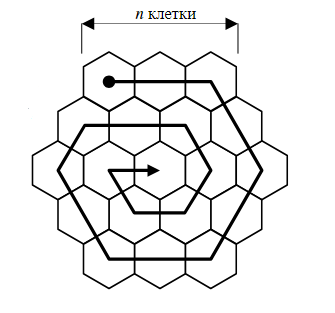

### Задача 1

Множество малки шестоъгълни клетки изграждат голямо шестоъгълно поле. Всяка от страните на полето има n клетки.
Оброждането на клетките на полето е спираловидно, както е показано насхемата. В първите m клетки по реда на обхождането се записват поредни естествени числа, започвайки от числото s, а всички клетки след m-тата остават празни. 

Да се определи кое число е записано в q-тата клетка на p-тия ред с клетки от полето. Номерацията на редовете е отгоре надолу и започва от 1. Номерацията на клетките в реда е отляво надясно и започва от 1. Ако посочената
клетка е празна, да се изведе `-`.

Да се определи на кой ред и в коя поредна клетка от него е записано най-голямото число в полето.

#### Пример
**Вход**:  
n = 3  
m = 16  
s = 5  
p = 2  
q = 3

**Изход:**  
18  
4 3

---

### Задача 2

Ябълки са подредени в щайга, разположени на N реда и M колони. Две от тях са изгнили в началото. Всеки ден всички ябълки, които се допират до гнили, също загниват. Да се определи колко ябълки все още ще са здрави след T дни.

От стандартния вход се въвеждат N, M, T. Следват 2 реда с координати на изгнили ябълки, като броенето на редовете и колоните започва от 0. 

#### Пример
**Вход**:  
6 8 3  
3 4  
1 6

**Изход:** 18

#### Илюстрация на примера
Ден 0:
|   | 0 | 1 | 2 | 3 | 4 | 5 | 6 | 7 |
|---|---|---|---|---|---|---|---|---|
| 0 |   |   |   |   |   |   |   |   |
| 1 |   |   |   |   |   |   | X |   |
| 2 |   |   |   |   |   |   |   |   |
| 3 |   |   |   |   | X |   |   |   |
| 4 |   |   |   |   |   |   |   |   |
| 5 |   |   |   |   |   |   |   |   |

Ден 1:
|   | 0 | 1 | 2 | 3 | 4 | 5 | 6 | 7 |
|---|---|---|---|---|---|---|---|---|
| 0 |   |   |   |   |   |   | x |   |
| 1 |   |   |   |   |   | x | X | x |
| 2 |   |   |   |   | x |   | x |   |
| 3 |   |   |   | x | X | x |   |   |
| 4 |   |   |   |   | x |   |   |   |
| 5 |   |   |   |   |   |   |   |   |

Ден 2:
|   | 0 | 1 | 2 | 3 | 4 | 5 | 6 | 7 |
|---|---|---|---|---|---|---|---|---|
| 0 |   |   |   |   |   | x | X | x |
| 1 |   |   |   |   | x | X | X | X |
| 2 |   |   |   | x | X | x | X | x |
| 3 |   |   | x | X | X | X | x |   |
| 4 |   |   |   | x | X | x |   |   |
| 5 |   |   |   |   | x |   |   |   |

Ден 3:
|   | 0 | 1 | 2 | 3 | 4 | 5 | 6 | 7 |
|---|---|---|---|---|---|---|---|---|
| 0 |   |   |   |   | x | X | X | X |
| 1 |   |   |   | x | X | X | X | X |
| 2 |   |   | x | X | X | X | X | X |
| 3 |   | x | X | X | X | X | X | x |
| 4 |   |   | x | X | X | X | x |   |
| 5 |   |   |   | x | X | x |   |   |