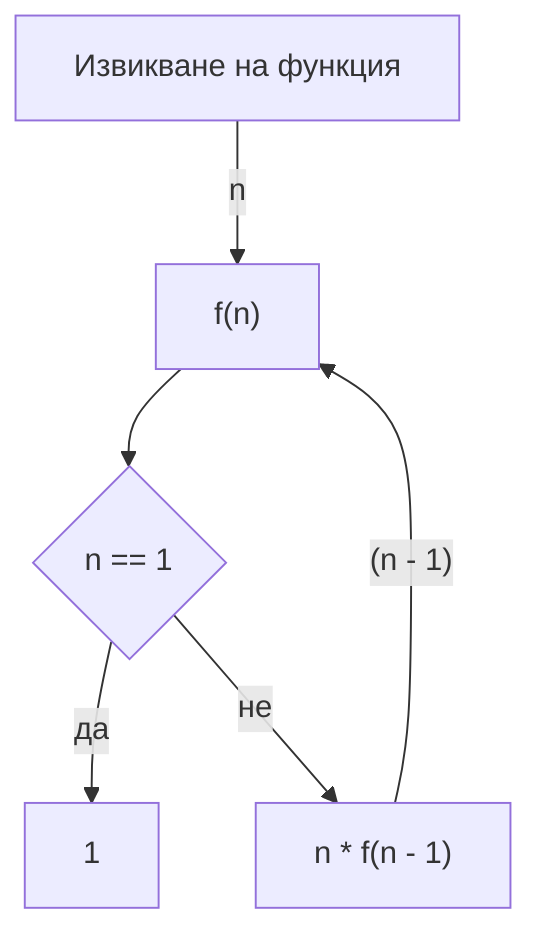
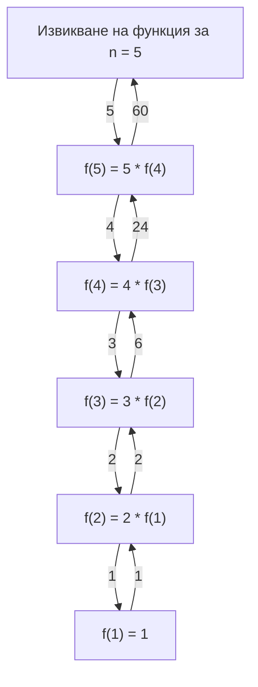

## Рекурсия

- функцията извиква сама себе си
- дъно на рекурсията

**Пример**
Намиране на n! = n*(n-1)*...*1
```c++
int f(int n) {
    if (n == 1) {
        return 1;
    }

    return n * f(n - 1);
}
```



Илюстрация на извикванията:



### Обхождане с връщане назад (backtracking)


